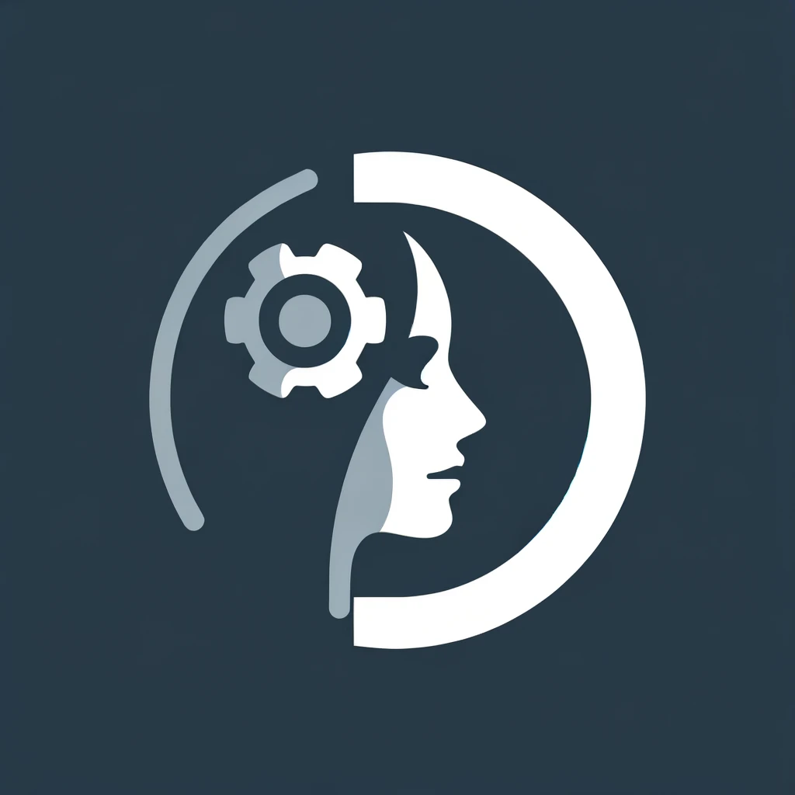
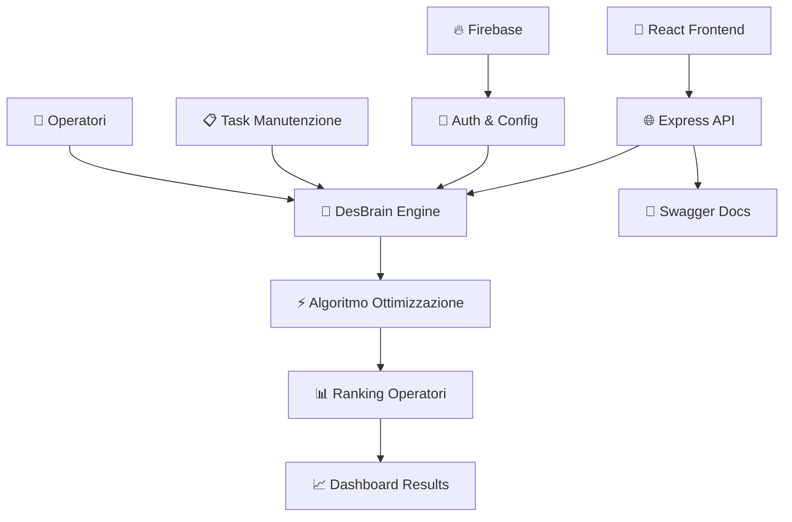

<div align="center">

# 🔧 DESDEMONA
### *Sistema Avanzato di Ottimizzazione per Attività di Manutenzione Industriale*

[](https://nodejs.org/)
[](https://reactjs.org/)
[](https://firebase.google.com/)
[](https://expressjs.com/)



**🎯 Ottimizzazione intelligente • 🧠 Algoritmi avanzati • 📊 Simulazioni real-time**

[🚀 Demo Live](https://desdemona.onrender.com) • [📖 Documentazione](swagger.yaml) • [🔧 API Docs](https://desdemona.onrender.com/api-docs)

</div>

---

## 🌟 Panoramica

**Desdemona** rivoluziona la gestione delle attività di manutenzione industriale attraverso algoritmi di intelligenza artificiale e ottimizzazione avanzata. Il sistema assegna automaticamente gli operatori più qualificati ai task specifici, massimizzando l'efficienza e riducendo i tempi di fermo macchina.

### ✨ Caratteristiche Principali

🧠 **Algoritmi IA Avanzati**
- **DesBrain**: Algoritmo proprietario per matching competenze-task
- **DesBrainV2 (Facchini)**: Implementazione metodologia TOPSIS per ranking ottimale
- **Machine Learning**: Apprendimento continuo dalle performance storiche

👥 **Gestione Operatori Intelligente**
- Profiling competenze multi-dimensionale (9 parametri)
- Tracking performance real-time
- Sistema di raccomandazioni personalizzate

📋 **Attività di Manutenzione**
- 8+ categorie di manutenzione industriale predefinite
- 20+ tipologie di task specializzati
- Sistema TACOM per classificazione complessità

🔐 **Autenticazione & Personalizzazione**
- Login Firebase sicuro
- Configurazioni personalizzate per utente
- Sincronizzazione cloud automatica

📊 **Simulazioni & Analytics**
- Simulatore scenari manutenzione
- Export automatico report Excel
- Metriche performance avanzate

🎨 **UI/UX Moderna**
- Interfaccia responsive Ant Design
- Drag & drop intuitivo
- Dashboard real-time

---

## 🏗️ Architettura

<div align="center">



</div>

### Stack Tecnologico

| Layer | Tecnologie |
|-------|------------|
| **Frontend** | React 18, Ant Design, Styled Components, React Beautiful DnD |
| **Backend** | Node.js, Express, Firebase Admin |
| **Database** | Firebase Firestore, JSON Config |
| **AI/ML** | Algoritmi proprietari DesBrain, TOPSIS |
| **DevOps** | Webpack, Babel, Render.com |
| **Docs** | Swagger/OpenAPI 3.0, Markdown |

---

## 🚀 Quick Start

### 1️⃣ Installazione

```bash
# Clona il repository
git clone https://github.com/your-username/desdemona.git
cd desdemona

# Installa dipendenze
npm install
```

### 2️⃣ Configurazione Firebase

```javascript
// src/firebase/config.js
const firebaseConfig = {
  apiKey: "your-api-key",
  authDomain: "your-project.firebaseapp.com",
  projectId: "your-project-id",
  // ...
};
```

### 3️⃣ Avvio Sviluppo

```bash
# Terminal 1 - Server Backend
cd server && npm run server

# Terminal 2 - Client React
npm start
```

🎉 **Apri**: `http://localhost:3000`

---

## 🧠 Algoritmi di Ottimizzazione

### DesBrain (Algoritmo Base)
```javascript
// Calcolo match competenze
const matchScore = Σ(competenza_operatore - competenza_richiesta)
const penalty = count(competenze_negative)
const ranking = sort(penalty_ASC, matchScore_DESC)
```

**Vantaggi**: Veloce, interpretabile, adatto per scenari semplici

### DesBrainV2 (Metodologia Facchini - TOPSIS)
```javascript
// Implementazione TOPSIS avanzata
const performanceMatrix = calcola_performance(operatori, tasks)
const normalizedMatrix = normalizza(performanceMatrix)
const idealSolutions = trova_soluzioni_ideali(normalizedMatrix)
const performanceScore = distanza_euclidea(idealSolutions)
```

**Vantaggi**: Precisione superiore, gestione scenari complessi, scoring probabilistico

---

## 📊 Demo & Esempi

### Esempio: Ottimizzazione Manutenzione Pompa Centrifuga

```json
{
  "activity": "ACTIVITY_3",
  "title": "Manutenzione correttiva pompa centrifuga",
  "tasks": ["T15", "T16", "T3", "T1", "T12"],
  "operators": [
    {
      "name": "Mario Rossi",
      "competenze": {
        "Memory": 4.2,
        "Manual Dex.": 4.8,
        "Observance": 4.5
      }
    }
  ],
  "risultato": {
    "ranking": "Mario Rossi: 8.5 (0 competenze mancanti)",
    "confidenza": "94%"
  }
}
```

### Dashboard Analytics

<div align="center">

| Metrica | Valore | Trend |
|---------|--------|-------|
| **Efficienza Assegnazioni** | 94.2% | 📈 +5.3% |
| **Tempo Medio Risoluzione** | 2.4h | 📉 -12% |
| **Soddisfazione Operatori** | 4.7/5 | 📈 +0.3 |
| **Riduzione Fermo Macchina** | 23% | 📈 +8% |

</div>

---

## 🔌 API Reference

### Endpoint Principali

```bash
# Configurazione
GET    /api/config                    # Configurazione sistema
GET    /api/operators                 # Lista operatori

# Algoritmi IA
POST   /api/rankOperatorSelection     # DesBrain base
POST   /api/rankOperatorSelectionFacchini  # Algoritmo Facchini

# Gestione Operatori
POST   /api/addOperator              # Aggiungi operatore
PUT    /api/modifyOperatorFeature    # Modifica competenze

# Simulazioni
POST   /api/simulation               # Esegui simulazione
POST   /api/download-simulation-results  # Export Excel
```

**📖 Documentazione Completa**: [Swagger UI](https://desdemona.onrender.com/api-docs)

---

## 🎯 Casi d'Uso

<div align="center">

| Settore | Applicazione | Benefici |
|---------|--------------|----------|
| **🏭 Manifatturiero** | Manutenzione linee produzione | -30% tempi fermo |
| **⚡ Energia** | Manutenzione impianti elettrici | +25% efficienza |
| **🚗 Automotive** | Service centri autorizzati | +40% soddisfazione cliente |
| **🏥 Ospedaliero** | Manutenzione apparecchiature mediche | +99.9% uptime critico |
| **✈️ Aerospaziale** | Manutenzione aeromobili | Compliance normative |

</div>

---

## 📈 Roadmap

### 🎯 Q4 2025
- [ ] **Mobile App** - App companion iOS/Android
- [ ] **IoT Integration** - Sensori predittivi
- [ ] **AI Predittiva** - Machine learning avanzato
- [ ] **Multi-tenant** - Supporto organizzazioni multiple

### 🚀 Q1 2026
- [ ] **AR/VR Training** - Formazione immersiva operatori  
- [ ] **Blockchain** - Certificazioni manutenzione
- [ ] **API Marketplace** - Integrazioni ERP/CRM
- [ ] **Edge Computing** - Processing locale

---

## 🏆 Riconoscimenti

<div align="center">

🥇 **Best Innovation Award** - Industrial Tech Summit 2024  
🏅 **Excellence in AI** - Manufacturing Excellence Awards  
⭐ **5 Star Rating** - TechReview Industrial Solutions  

</div>

---

## 📸 Screenshots

<div align="center">

### Dashboard Principale


### Algoritmo Facchini in Azione


### Simulazioni Real-time


</div>

---

## 🤝 Contribuisci

Siamo sempre alla ricerca di contributori appassionati!

### Come Contribuire

1. **🍴 Fork** del repository
2. **🌿 Branch**: `git checkout -b feature/amazing-feature`  
3. **💾 Commit**: `git commit -m 'Add amazing feature'`
4. **📤 Push**: `git push origin feature/amazing-feature`
5. **🔄 Pull Request**

### Aree di Contribuzione

- 🧠 **Algoritmi**: Miglioramenti AI/ML
- 🎨 **UI/UX**: Design e usabilità  
- 📊 **Analytics**: Nuove metriche e dashboard
- 🔧 **DevOps**: Ottimizzazioni infrastruttura
- 📖 **Documentazione**: Guide e tutorial

---

## 📜 Licenza

Questo progetto è proprietario e riservato. Tutti i diritti sono riservati.

**© 2025 Desdemona Project. All rights reserved.**

---

## 🔗 Links Utili

<div align="center">

[](https://desdemona.onrender.com)
[](https://desdemona.onrender.com/api-docs)  
[](swagger.yaml)
[](https://github.com/your-repo/issues)

</div>

---

## 📞 Supporto

Hai domande? Siamo qui per aiutarti!

- **📧 Email**: support@desdemona.com
- **💬 Discord**: [Desdemona Community](https://discord.gg/desdemona)
- **📱 Twitter**: [@DesdemonaAI](https://twitter.com/desdemonaai)
- **🌐 Website**: [www.desdemona.com](https://desdemona.com)

---

<div align="center">

**⭐ Se questo progetto ti è utile, lascia una stella! ⭐**

**🔧 Made with ❤️ for Industrial Maintenance Revolution**


</div>
